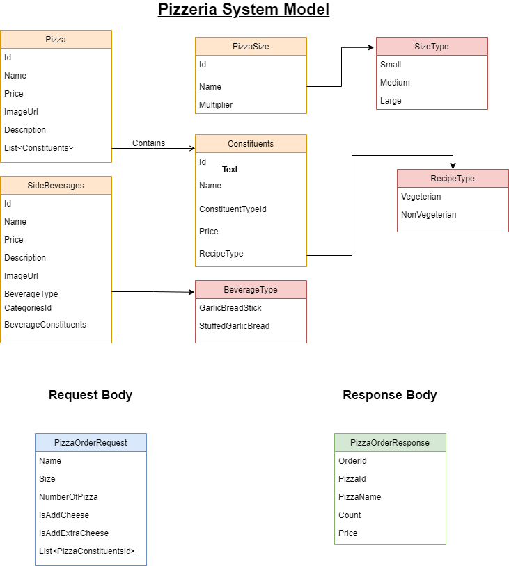

# Pizzeria-Ordering-System
## Branch Name: Master

# API :
	1. This is the Backend Solution written in .Net Core 3.1
  2. Build the Solution and Run, This would run the solution on https://localhost:44303/ (Configured)
# Angular : 
	1. Run Command npm install
	2. Run Command npm run build and then ng serve This would run the UI solution on http://localhost:4200
